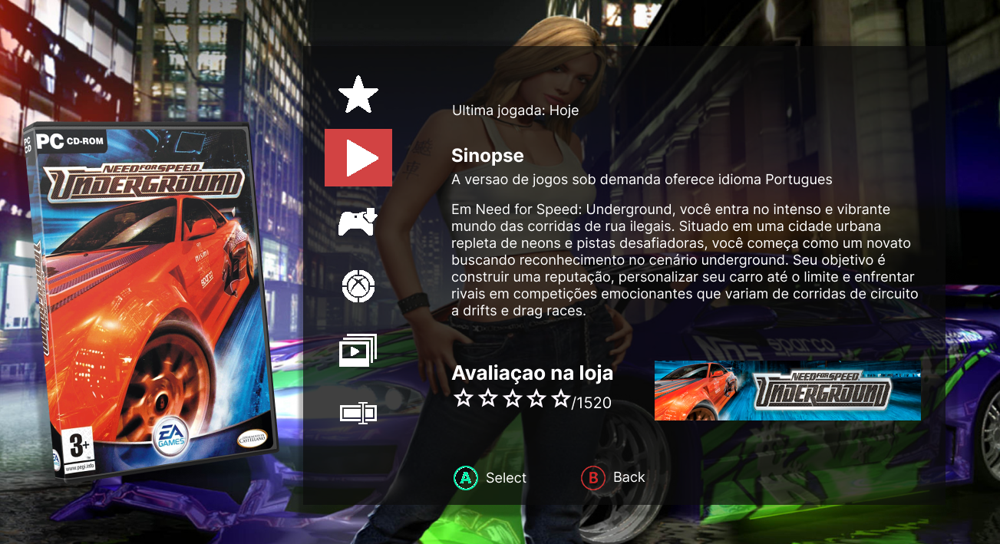

# Organizador de jogos

Esse projeto tem o intuito de organizar os games que eu ando jogando ultimamente, no intuito de me permitir adiconar screenshots das minhas plays e fazer reviews deles assim que eu os finalizo. Por enquanto só possui a tela de propriedades do jogo, onde será feita a mágica.

Obs: Isso eh um projeto de estudo e estou tentando replicar a interface da Dashboard Aurora, presente no sistema do Xbox 360.

---

## Demonstração



---

## Tecnologias Usadas

- **HTML5** - Para estruturação do conteúdo da página.
- **CSS3** - Para estilização da página, incluindo layouts responsivos e efeitos.
- **Figma** - Para o design da interface.

---

## Como Rodar o Projeto

### Pré-requisitos
Antes de rodar o projeto, você precisará de:

- Um navegador moderno (Chrome, Firefox, Safari, etc.).

### Rodando Localmente
1. Clone este repositório para a sua máquina local:

   ```bash
   git clone https://github.com/MarioJamisson/html.git

2. Navegue até o diretório do projeto:
   ```bash
   cd html

3. Abra o index.html em seu navegador de preferência:
   ```bash
   open index.html  # No macOS
   start index.html  # No Windows
   xdg-open index.html  # No Linux

## Estrutura do projeto

### O projeto contém os seguintes arquivos e pastas

   ```bash
   /html
   │
   ├── index.html           # Arquivo principal HTML
   ├── index.css            # Estilos CSS para a página
   ├── Assets/              # Pasta com as imagens do projeto
   │   ├── image.png        # Imagem do fundo
   │   ├── need-for-speed-banner.png # Banner do projeto
   │   └── screenshot.png   # Screenshot para o README
   └── README.md            # Arquivo de documentação
   ```

### Como adicionar imagens no projeto

1. Coloque suas imagens na pasta Assets/

2. Atualize os caminhos das imagens no HTML e CSS com base na estrutura do diretório

Exemplo:
   ```bash
   
```

Exemplo referência CSS:
   ```bash
   .need-for-speed {
  background: url('imagens/image.png') no-repeat center center;
  background-size: cover;
  }
```

## Licença

Este projeto está licenciado sob a Licença MIT.


